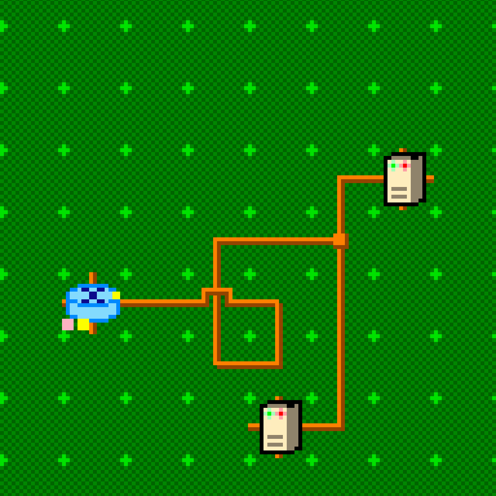

# Ioio

Ioio (from maori: [nerve](https://maoridictionary.co.nz/search?keywords=ioio)) is intended to be a simulator of networked infrastructure, so that one can simulate simple execution patterns and see failure modes such as bottlenecks forming.

And truly, really, this is about me excercising golang.



## Concepts

### Map

A player will first prepare a map (or perhaps load a pre-existing map), using the [Tiled](https://www.mapeditor.org/) editor, and supplied tileset. This mostly specifies how nodes are interconnected, in a fun (?) way. Map will be used to see which nodes are reachable from which.

Map will contain such elements as:

* hosts - groupings of cores that execute requests, with common scheduling queue
* cores - virtual CPUs that can execute processing, dequeing from the host scheduling queue
* routers - like hosts, except they have infinite processing capability ("the internet")
* wires - network connections

### Requests

To encode what actually happens on the map, a YAML-based program will be provided by the player. Each program is a bit like a spec in a parallel-processing language in that it encodes from the top level which cores get what kind of processing requests.

Note in the spec below, *s* stands for a sekunda, an imaginary unit of time, otherwise known as a tick. 1000*ms* is 1*s* etc.

#### Example

Here is an example of a web traffic arriving at a load balancer, and doing some imaginary website renders.

```yml
web_request:
  ctl: [ h:internet ]
  prg: 
  - rps/1:
    - get:
      desc: web request from the internet
      ctl: [ h:lb, to:10s ]
      prg:
      - get
        desc: load balancing to two web nodes
        ctl: [ h:[web1, web2], lb:equal, to:10s ]
        prg:
        - c/750ms
        - s/3:
          - get:
            desc: couple of queries
            ctl: [ h:db, to:1s, rt:backoff/3 ]
            prg:
            - c/10ms
```

This reads as: once per second, trigger requests from the internet to edge load-balancer. Load balancer is to contact "web1" or "web2" (50/50 chance), timing out in 10s.

Web boxes are to execute 700ms of processing, followed by three sequential requests to "db", which in turn take 10ms each. DB requests will have 1s timeout, and will backoff and retry 3 times on failure.

### Top-level request blocks

Request blocks are top level elements and start with a label acting like a comment. Each request block is an equivalent of a `get` statement, except it's top level.

### Instructions

Instructions can all go into the `prg` parameter.

#### get

Invokes a network request to another host or hosts. This effectively transitions program processing to the target. Takes `ctl` and `prg` statements, as below.

For get statement to succeed, the host must be reachable from current host via a wire.

##### ctl

`ctl` is a `get` parameter that defines a hash of operational settings:

* `h` - host to execute the `prg` on
* `lb` - how to choose where to send requests to, if more than one host is listed in `h`
* `to` - timeout for the `prg`, after which retry policy is invoked
* `rt` - retry policy

##### prg

`prg` is a `get` parameter that specifies an array of instructions to run sequentially.

##### desc

Helpful human-readable comment.

#### rps/N

Takes an array of instructions to execute N times per second. E.g. rps/1 will trigger the program once per second, forever.

#### p/N

Takes an array of instructions to execute in parallel N times.

#### s/N

Takes an array of instructions to repeat N times.

#### c/T

Places the current processing in queue for core processing, and upon successful scheduling, it will occupy the core for time T. It will continue occupyint the core, even if the higher level instruction ran into timeout.

